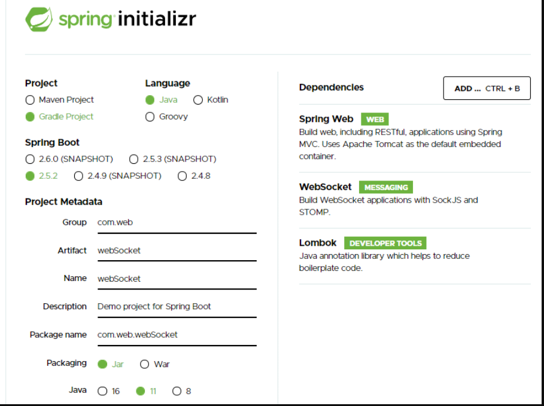
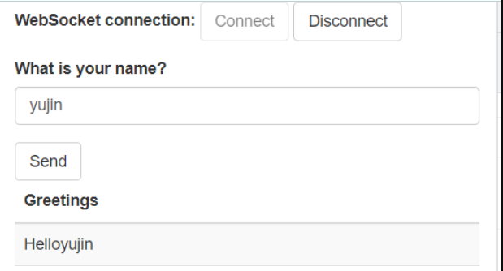
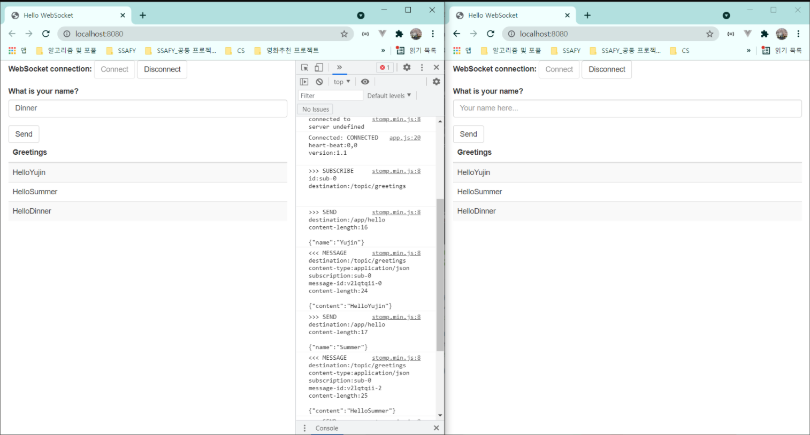

# WebSocket

> 해당 리포지토리는 하위 공식문서를 바탕으로 공부하고 기록한 것입니다.
>
> [공식 문서](https://spring.io/guides/gs/messaging-stomp-websocket/)


> 해당 가이드는 브라우저와 서버 간에 메시지를 주고받는 "Hello, world" 애플리케이션을 만드는 과정을 안내합니다.

> WebSocket은 TCP 위의 얇고 가벼운 계층입니다. 이것은 메시지를 포함하기 위해 "서브 프로토콜" 을 사용하는 데 적합합니다.

> 이 가이드에서는 Spring과 함께 STOMP 메시징을 사용하여 대화형 웹 애플리케이션을 만듭니다.

> 기본사항을 건너뛰기 하려면 해당 git에서 리포지토리를 다운로드하여 압축을 푸세요
>
> [spring-guides/gs-messaging-stomp-websocket](https://github.com/spring-guides/gs-messaging-stomp-websocket)

# 1. [start.spring.io](http://start.spring.io) 로 프로젝트 생성하기



- 해당 구조로 프로젝트를 생성합니다.
- 필요한 의존성의 아래 3가지 입니다.
  - Spring Web
  - WebSocket
  - Lombok


## 1-2. 종속성 추가

```java
// 종속성 추가 시작
	implementation 'org.webjars:webjars-locator-core'
	implementation 'org.webjars:sockjs-client:1.0.2'
	implementation 'org.webjars:stomp-websocket:2.3.3'
	implementation 'org.webjars:bootstrap:3.3.7'
	implementation 'org.webjars:jquery:3.1.1-1'
	// 끝
```


## 1-3. 리소스 표현 클래스 생성

### HelloMessage

```jsx
@Getter @Setter
public class HelloMessage {
    private String name;

    // 기본 생성자
    public HelloMessage() {
    }

    // 추가 생성자
    public HelloMessage(String name) {
        this.name = name;
    }

}
```

- 이름을 받고 이를 get, set 할 수 있습니다.
- 작성된 이름을 저장하는 클래스 입니다.


### Greeting

```jsx
@Getter
public class Greeting {

    private String content;

    public Greeting(String content) {
        this.content = content;
    }

}
```

- Lombok의 Getter을 설정해 getContent 가 가능하도록 합니다.
- 해당 서비스는 이름이 포함된 인사말 메시지를 출력해줍니다.
- 이에 이름이 포함된 인사말 Content를 content 변수에 저장할 수 있도록 Greeting 클래스를 생성합니다.


## 1-4. 메시지 처리 컨트롤러 만들기

```jsx
package com.example.messagingstompwebsocket;

import org.springframework.messaging.handler.annotation.MessageMapping;
import org.springframework.messaging.handler.annotation.SendTo;
import org.springframework.stereotype.Controller;
import org.springframework.web.util.HtmlUtils;

@Controller
public class GreetingController {

  @MessageMapping("/hello")
  @SendTo("/topic/greetings")
  public Greeting greeting(HelloMessage message) throws Exception {
    Thread.sleep(1000); // simulated delay
    return new Greeting("Hello, " + HtmlUtils.htmlEscape(message.getName()) + "!");
  }

}
```

- Spring에서 STOMP 메시지는 `@Controller` 클래스로 라우팅될 수 있습니다.

- `@MessageMapping` 어노테이션은 `/hello`로 메시지가 보내지면 `greeting()` 함수를 실행시키도록 합니다.

- 1초 후, `greeting()` 메소드는 Greeting 객체를 생성하고 반환합니다.

  ⇒ 해당 반환값은 모든 `/topic/greeting` subscribers 에게 브로드캐스트 됩니다.

------

# 2. STOMP 메시징을 위한 Spring 구성

```jsx
package com.example.messagingstompwebsocket;

import org.springframework.context.annotation.Configuration;
import org.springframework.messaging.simp.config.MessageBrokerRegistry;
import org.springframework.web.socket.config.annotation.EnableWebSocketMessageBroker;
import org.springframework.web.socket.config.annotation.StompEndpointRegistry;
import org.springframework.web.socket.config.annotation.WebSocketMessageBrokerConfigurer;

@Configuration
@EnableWebSocketMessageBroker
public class WebSocketConfig implements WebSocketMessageBrokerConfigurer {

  @Override
  public void configureMessageBroker(MessageBrokerRegistry config) {
    config.enableSimpleBroker("/topic");
    config.setApplicationDestinationPrefixes("/app");
  }

  @Override
  public void registerStompEndpoints(StompEndpointRegistry registry) {
    registry.addEndpoint("/gs-guide-websocket").withSockJS();
  }

}
```

- `WebSocketConfig`는 `@Configuration` 어노테이션과 함께 `@EnableWebSocketMessageBroker` 를 사용하기도 합니다.

- `@EnableWebSokcetMessageBroker` 은 말 그대로 WebSocket 메시지를 핸들링할 수 있도록 해줍니다.

- `enableSimpleBroker()` 는 메모리 기반 메시지 broker 이고, `/topic` 접두사가 붙은 클라이언트에 인사말 메시지를 다시 전달할 수 있도록 해줍니다.

- 또한, `/app` 주석이 달린 메서드에 바인딩된 메시지의 접두사를 지정합니다.

  ⇒ 예를 들어 `/app/hello` 는 `GreetingController.greeting()` 메서드가 처리하도록 매핑되는 끝점이다.

- `registerStompEndpoints()` 는 `/gs-guide-websocket` 은 WebSoket을 사용할 수 없는 경우 대체 전송을 사용할 수 있도록 SockJS 폴백 옵션을 활성화 하여 끝점을 등록합니다.


## 2-1. 브라우저 클라이언트 만들기



### src/main/resources/static/index.html

```jsx
<!DOCTYPE html>
<html>
<head>
    <title>Hello WebSocket</title>
    <link href="/webjars/bootstrap/css/bootstrap.min.css" rel="stylesheet">
    <link href="/main.css" rel="stylesheet">
    <script src="/webjars/jquery/jquery.min.js"></script>
    <script src="/webjars/sockjs-client/sockjs.min.js"></script>
    <script src="/webjars/stomp-websocket/stomp.min.js"></script>
    <script src="/app.js"></script>
</head>
<body>
<noscript><h2 style="color: #ff0000">Seems your browser doesn't support Javascript! Websocket relies on Javascript being
    enabled. Please enable
    Javascript and reload this page!</h2></noscript>
<div id="main-content" class="container">
    <div class="row">
        <div class="col-md-6">
            <form class="form-inline">
                <div class="form-group">
                    <label for="connect">WebSocket connection:</label>
                    <button id="connect" class="btn btn-default" type="submit">Connect</button>
                    <button id="disconnect" class="btn btn-default" type="submit" disabled="disabled">Disconnect
                    </button>
                </div>
            </form>
        </div>
        <div class="col-md-6">
            <form class="form-inline">
                <div class="form-group">
                    <label for="name">What is your name?</label>
                    <input type="text" id="name" class="form-control" placeholder="Your name here...">
                </div>
                <button id="send" class="btn btn-default" type="submit">Send</button>
            </form>
        </div>
    </div>
    <div class="row">
        <div class="col-md-12">
            <table id="conversation" class="table table-striped">
                <thead>
                <tr>
                    <th>Greetings</th>
                </tr>
                </thead>
                <tbody id="greetings">
                </tbody>
            </table>
        </div>
    </div>
</div>
</body>
</html>
```

- 해당 HTML 파일은 Websocket 위의 STOMP 로 통신하는 서버를 사용하기 위해 SockJS 와 STOMP 라이브러리를 import 합니다.

  

### src/main/resources/static/app.js

```jsx
var stompClient = null;

// 🚩 1. Connect 설정을 바꾸는 함수
function setConnected(connected) {
    $("#connect").prop("disabled", connected);
    $("#disconnect").prop("disabled", !connected);
    if (connected) {
        $("#conversation").show();
    }
    else {
        $("#conversation").hide();
    }
    $("#greetings").html("");
}

// 🚩 2. Connect 를 눌렀을 때
function connect() {

		// ✅ SockJS를 통해서 socket 을 생성합니다.
    var socket = new SockJS('/gs-guide-websocket');
    stompClient = Stomp.over(socket);
    stompClient.connect({}, function (frame) {
        setConnected(true);
        console.log('Connected: ' + frame);

				// ✅ stompClient 에 '/topic/greetings' 구독을 합니다...?
        stompClient.subscribe('/topic/greetings', function (greeting) {
            showGreeting(JSON.parse(greeting.body).content);
        });
    });
}

// 🚩 3. Disconnect 를 눌렀을 때
function disconnect() {
    if (stompClient !== null) {
        stompClient.disconnect();
    }
    setConnected(false);
    console.log("Disconnected");
}

// 🚩 4. 이름을 StompClient 로 보냅니다.
function sendName() {
    stompClient.send("/app/hello", {}, JSON.stringify({'name': $("#name").val()}));
}

// 🚩 5. Greeting 메시지를 표에 추가합니다.
function showGreeting(message) {
    $("#greetings").append("<tr><td>" + message + "</td></tr>");
}

// 🚩 6. 해당 function들을 index.html 의 이벤트와 연결합니다.
$(function () {
    $("form").on('submit', function (e) {
        e.preventDefault();
    });
    $( "#connect" ).click(function() { connect(); });
    $( "#disconnect" ).click(function() { disconnect(); });
    $( "#send" ).click(function() { sendName(); });
});
```


## 결과화면



